# SuperRank - frontend of the application
This is the application made in React.

The customer facing marketing site can be found here: [superrank-astro-marketing](https://github.com/autocontent-in/superrank-astro-marketing)

<br />
<br />

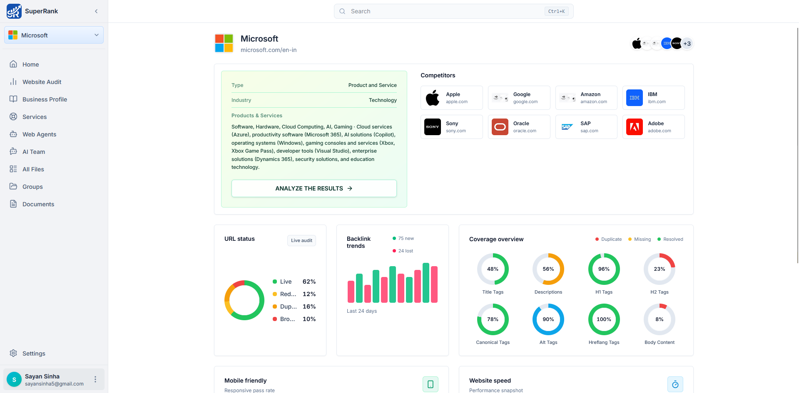

<br />

## Below are the required repos associated with this project:
#### Backend - [superrank-backend](https://github.com/autocontent-in/superrank-backend)
#### AI backend - [superrank-ai-fastapi](https://github.com/autocontent-in/superrank-ai-fastapi)

<br />
<br />

## Project Setup
#### 1. Clone the repo
```
git clone git@github.com:autocontent-in/superrank-frontend.git
```

#### 2. Navigate to the repo directory
```
cd superrank-frontend
```

#### 3. Copy `.env.example` and rename it to `.env`

#### 4. Install packages
```
npm install
```

#### 5. Run the project
```
npm run dev
```

#### Open `http://localhost:5173` in your browser

### That's it.

## Project Screenshots

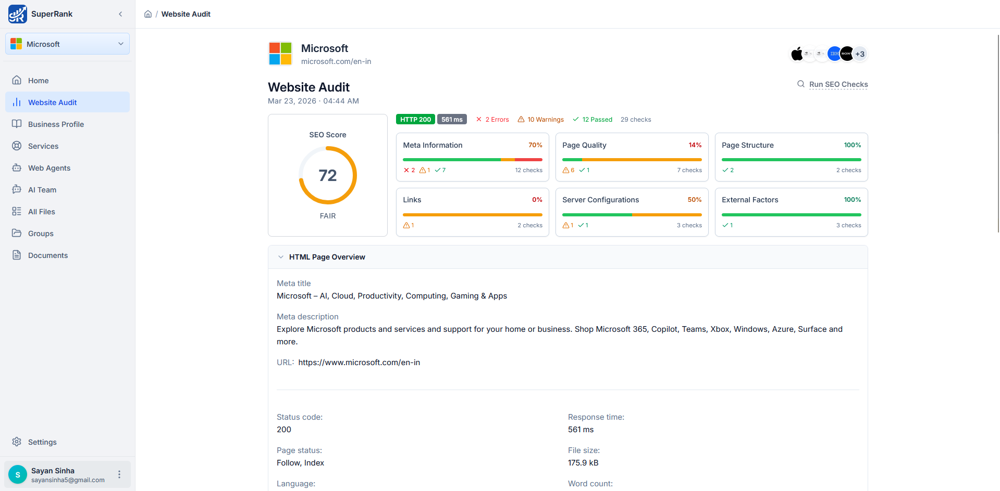
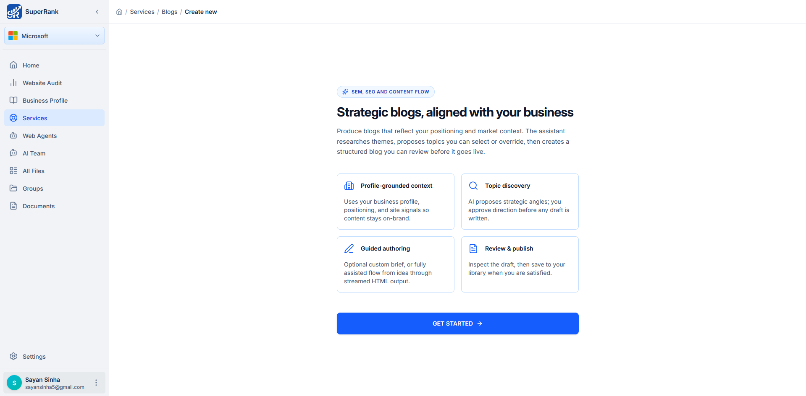
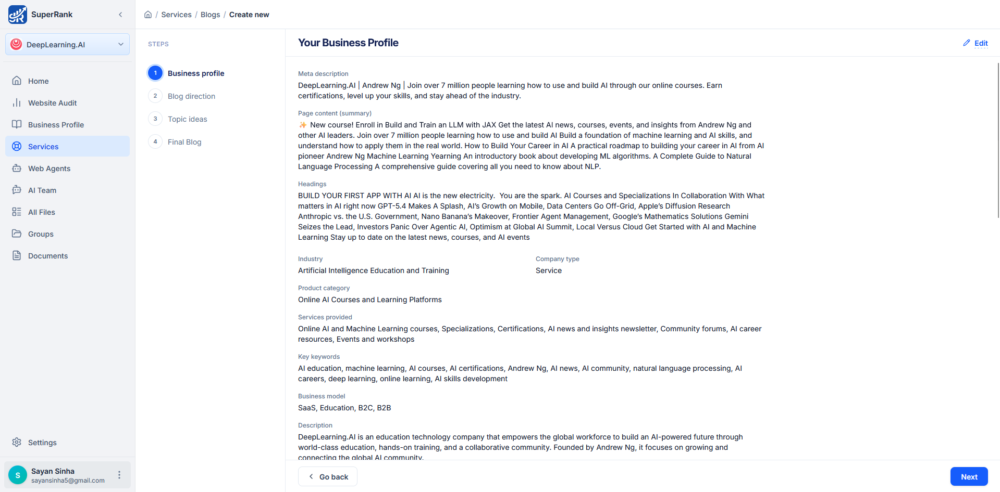
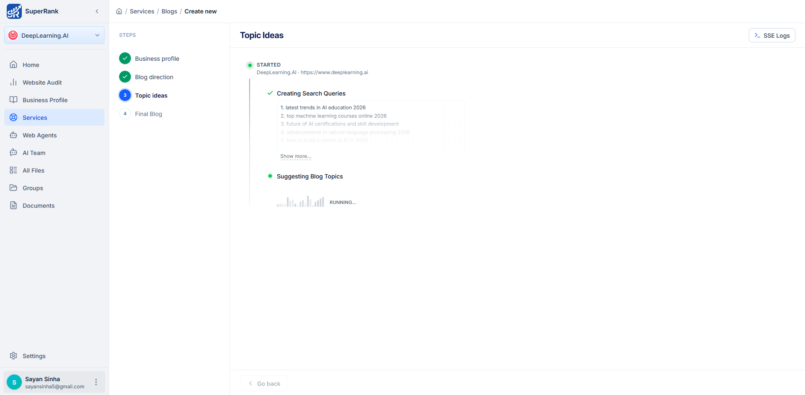
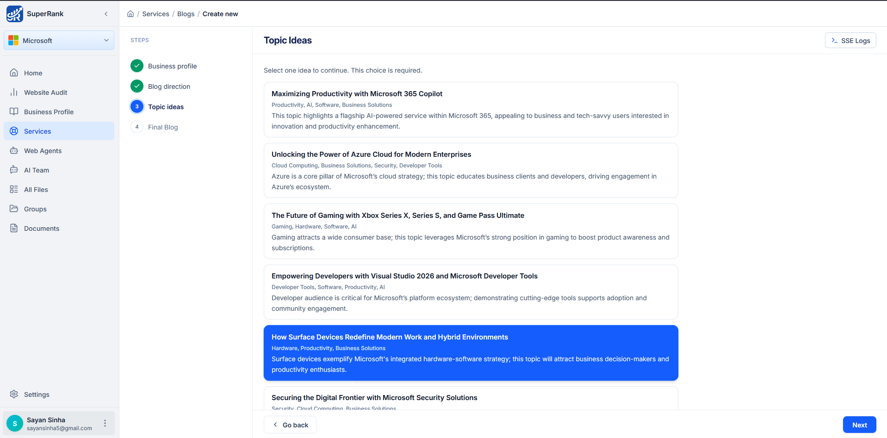
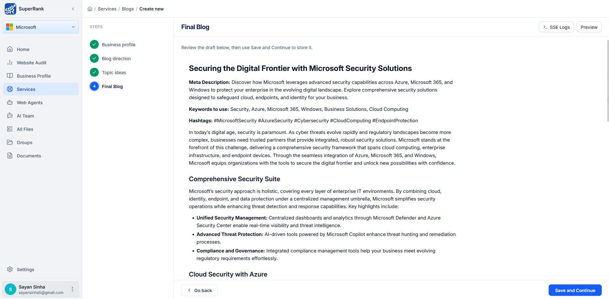
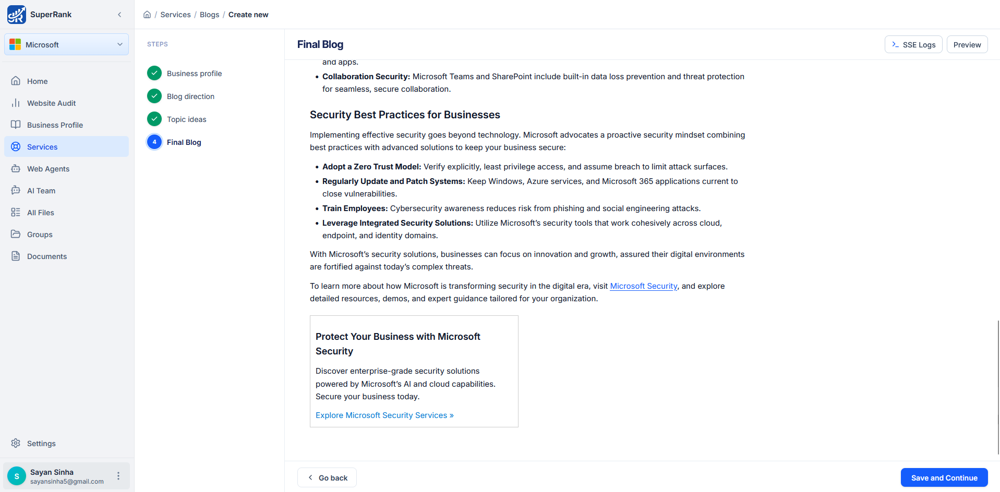
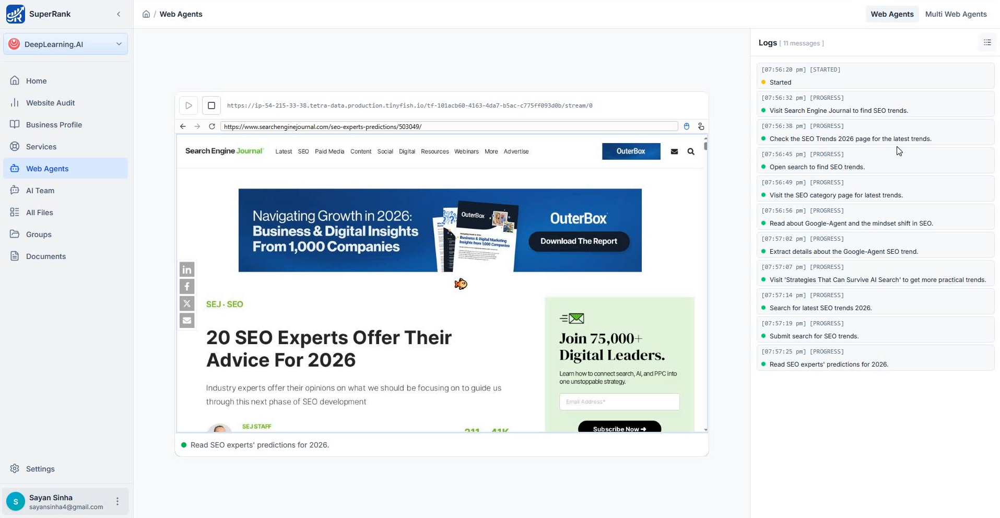
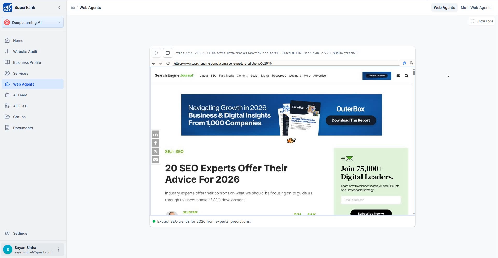
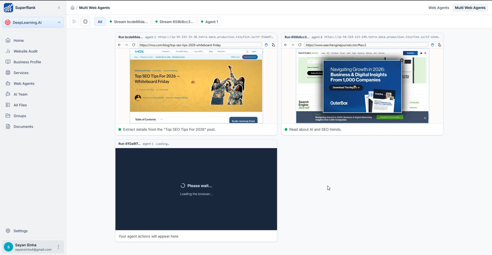

## Thank you
